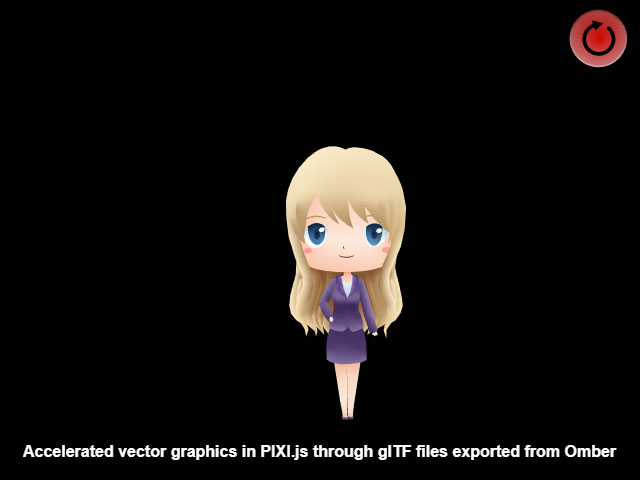

# glTF 2.0 Vector Graphics Plugin for Pixi.js



pixi-omber-gltf2-vector is a plugin for accelerated vector graphics on the [Pixi.js](http://www.pixijs.com) JavaScript graphics engine. Vector graphics are particularly useful for HTML5 games because it offers smaller file sizes than bitmaps for high resolution art that contains transparency. 

With the plugin, you can load vector art encoded as a 3d mesh in [glTF 2.0 format](https://www.khronos.org/gltf/) and then use the art in a game just like a normal Pixi.js sprite. Although the plugin is specifically designed to work with vector art created in the drawing program [Omber](https://www.wobastic.com/omber/), Omber has some support for loading SVG files and then resaving them out in glTF format.

## Using the Plugin

The [example](example/) directory contains a simple of example that uses the plugin to display some vector art, but a more detailed explanation of the steps needed to use the plugin is provided below.

### 1. Export vector art

The plugin loads vector art that has been converted into 3d meshes that can be rendered quickly by 3d graphics hardware. Use the Omber vector dawing program to create your vector art and then export your art to glTF format using these suggested [settings](https://www.wobastic.com/omber/help/gltf.html). The plugin currently expects data to exported as a .GLB file and NOT using floating-point colors. It is recommended that you use 1 pixel per meter for the scale, and to output meshes using the "Merge opaque meshes only" setting. When exporting, be sure to note the position of your drawing relative to the origin point of x=0, y=0. When displaying vector art in Pixi, the art will be centered around this origin point, so you may have to move your drawing before exporting so that the origin point is a reasonable location. 

### 2. Include the plugin code

Include the Pixi.js library and the pixi-omber-gltf2-vector plugin code in your HTML file. Be sure to include the plugin AFTER you include the Pixi library. A [pre-built version of the plugin](build/pixi-omber-gltf2-vector.js) is available in the build directory.

```
<script src="https://cdnjs.cloudflare.com/ajax/libs/pixi.js/4.7.3/pixi.min.js"></script>
<script src="build/pixi-omber-gltf2-vector.js"></script>
```

The pixi-omber-gltf2-vector API is accessible from the `PIXI.omber` namespace.

### 3. Load the glTF .glb files

After you initialize Pixi, you can use the standard Pixi loader to load the glTF 2.0 .glb files that you exported earlier

```
PIXI.loader
	.add('vector.glb')
	.load(start);
```

### 4. Use PIXI.omber.VectorMesh instead of PIXI.Sprite

The plugin will load the .glb files as `Gltf` objects instead of the `Texture` objects used for bitmap sprites. To display them, create a `PIXI.omber.VectorMesh` object instead of the normal `PIXI.Sprite` object. Continue to use `PIXI.Sprite` for your regular bitmap sprites. 

```
function start(loader, resources) {
	let mesh = new PIXI.omber.VectorMesh(resources['vector.glb'].gltf);
	app.stage.addChild(mesh);
}
```

### 5. Basic Pixi operations are supported

The regular Pixi transforms are currently supported by `VectorMesh`. For example, you can assign `x`, `y`, `rotation`, `scale` values on a mesh to move it around the screen. Basic rectangular hitboxes for detecting touches and clicks on vector objects are also supported.


## Examples

Various examples are provided that demonstrate how the PIXI plugin can be used.

- [Basic loading of vector art into PIXI.js](example/example.html)
- [Use of vector art and masks to draw a gradient-shaded area chart](example/mask_example.html)
- [Using Omber vector art as regular HTML images by rendering them at runtime with PIXI.js](example/html_img_example.html)
